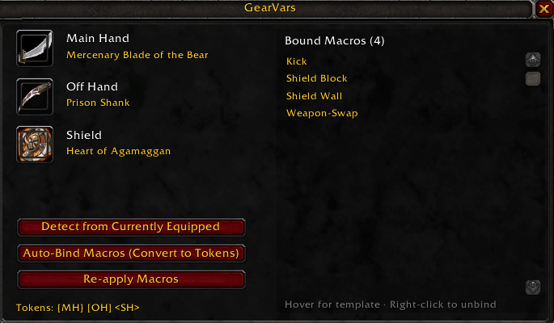
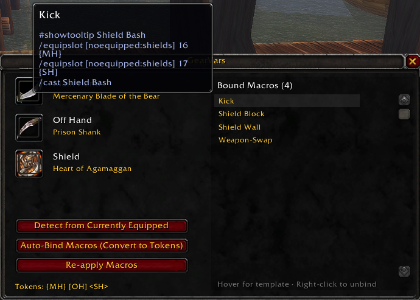

# GearVars



Stop editing macros every time you replace a weapon or shield.

GearVars stores your **Main Hand**, **Off Hand**, and **Shield** item names once. Any macro that uses the tokens `{MH}`, `[OH]`, or `<SH>` is automatically rewritten with the current item names whenever you change gear. Great for warriors who stance-dance and swap shields, but works for any class.

Tested on WoW Classic Era 1.15 (Interface 11508).

## Quick start

1. Type `/gv` to open the window.
2. Click **Detect from Currently Equipped** — fills the three slots from what you're wearing.
3. Click **Auto-Bind Macros (Convert to Tokens)** — scans every macro you have, replaces literal item names with `{MH}` / `{OH}` / `{SH}` tokens, and stores them.

Done. Next time you replace a weapon:

- Drag the new item onto the matching slot in the GearVars window, **or**
- Equip it and run `/gv detect`.

Every macro that uses that slot updates instantly.

## Example

Before:

```
#showtooltip Shield Block
/cast [stance:1/3] Defensive Stance
/equipslot [noequipped:shields] 16 Sequoia Hammer of Power
/equipslot [noequipped:shields] 17 Heart of Agamaggan
/cast Shield Block
```

After Auto-Bind, GearVars stores the template:

```
#showtooltip Shield Block
/cast [stance:1/3] Defensive Stance
/equipslot [noequipped:shields] 16 {MH}
/equipslot [noequipped:shields] 17 {SH}
/cast Shield Block
```

The macro your client actually runs is still the fully expanded form — GearVars writes the expanded body back to the macro whenever your gear changes.

## Tokens

You can write tokens in any of three styles, whichever your keyboard makes easiest:

- `{MH}` `{OH}` `{SH}`
- `[MH]` `[OH]` `[SH]`
- `<MH>` `<OH>` `<SH>`

Square brackets are safe here — `MH`/`OH`/`SH` aren't real macro conditionals, and substitution happens before WoW ever parses the macro.

## Inspecting bound macros

The right side of the window lists every macro GearVars is managing. Hover a row to preview the stored template body:



Right-click a row to unbind that macro (the macro itself isn't deleted — only GearVars forgets it). Orphaned templates — where the macro was renamed or deleted outside GearVars — are flagged in red.

## Slash commands

| Command | What it does |
|---|---|
| `/gv` | Open the window |
| `/gv detect` | Fill MH/OH/SH from equipped items |
| `/gv autobind` | Scan all macros, replace item names with tokens |
| `/gv bind <name>` | Capture one macro as a template |
| `/gv edit <name>` | Restore template body in the macro for editing |
| `/gv unbind <name>` | Forget a template |
| `/gv list` | Show bound templates |
| `/gv apply` | Re-write bound macros with current gear |
| `/gv minimap` | Toggle the minimap button |
| `/gv reset` | Wipe gear + templates (with confirmation) |
| `/gv help` | Print the command list |

## Notes

- **Combat-safe.** `EditMacro` is blocked by Blizzard during combat lockdown. If you change gear mid-fight, the update is queued and applied the instant combat ends.
- **2H detection.** Setting a two-handed weapon as Main Hand grays out and clears the Off Hand slot.
- **Per-character storage.** Each character has its own gear + templates.
- **No external libs.** Pure Lua, no LibStub/LibDBIcon/Ace dependencies.
- **Macro size limit.** WoW caps macro bodies at 255 characters. If your expanded macro overflows, WoW will truncate it.

## Install

### From CurseForge / Wago

(Once published) Install from the CurseForge or Wago client.

### Manual

1. Download the latest release zip.
2. Extract so the folder lives at:
   - **macOS:** `World of Warcraft/_classic_era_/Interface/AddOns/GearVars/`
   - **Windows:** `World of Warcraft\_classic_era_\Interface\AddOns\GearVars\`
3. Restart WoW (or `/reload`). Enable **GearVars** in the AddOns list at character select.

## License

MIT — see [LICENSE](LICENSE).
